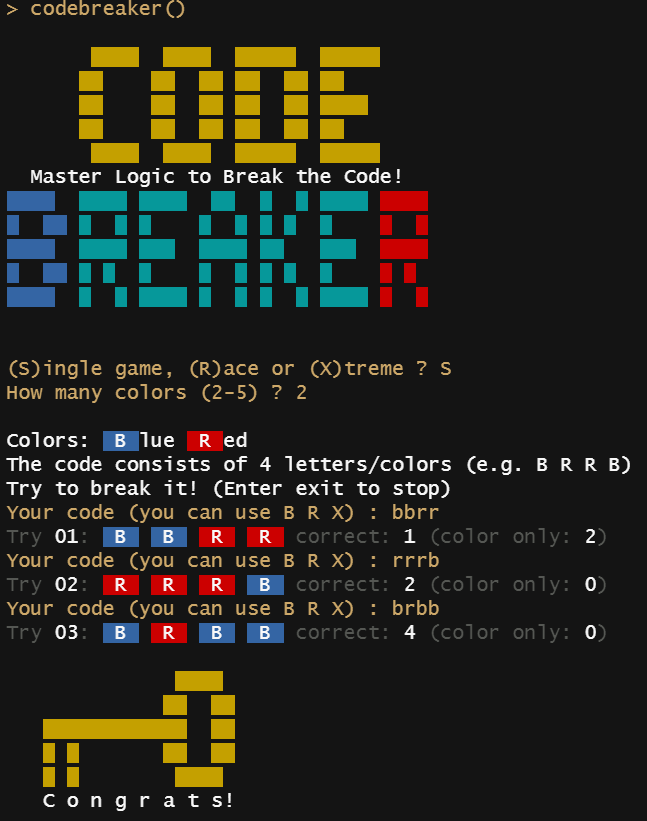

# codebreaker

Logic game written in R (in the style of the early 1980s home computer games)

This game is inspired by Mastermind, a game that became popular in the 1970s.

## Gameplay

You are a codebreaker and play against the computer who is the codemaker. The computer chooses a pattern of four colors (duplicates possible). You try to break the code by trying color patterns. The computer tells you the number of correct colors. Try to break the code in less steps as possible!

### Single Game

Choose the number of colors the computer can use to randomly create the code.
Then try to break it!

### Race

If you select "Race", you will play a series of games starting with 2 colors,
each round increasing the numbers of colors. If you mastered all 4 rounds you 
get the "Race-Cup"!

### Xtreme

Same like "Race", except that the computer is allowed to leave code digits empty (X).
